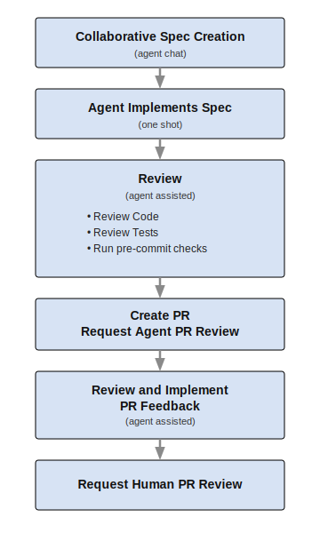

<p align="center">
  
</p>

# AI Assisted Development: Go Faster, Safely with Spec-Agent Workflow (SAW)

[Bob Dickinson](https://github.com/BobDickinson), March 2026

**In this guide I will show you how to leverage AI using an approach called Spec-Agent Workflow (SAW) to get a 2x to 4x engineering productivity improvement with no sacrifices in key areas like tech debt, quality, reliability, security, compliance, and others. This is not vibe coding; there is no AI slop involved; this is leveraging AI tools and best practices to build high-quality software better and faster than before.**

# Before We Unleash the Agents

## Assumption: You Are Building Real Software

We live in a world where there is the promise of AI gains in software development of anywhere from 10x to 100x to infinity X (no engineers needed at all). Swarms and teams of agents are being deployed. And all the way out on the frontier we have things like [GasTown](https://steve-yegge.medium.com/welcome-to-gas-town-4f25ee16dd04)  and the Wasteland with hundreds or thousands of agents burning tokens at an almost unimaginable rate (to what end I am still not quite sure).

Anthropic built their Claud Cowork product in 10 days with agents writing all of the code (guided by only four engineers). They didn't give out all of the stats for that project, but they had a similar project [building a C compiler in Rust](https://www.anthropic.com/engineering/building-c-compiler) against some very well defined specs and tests, over a similar timeframe. That project burned $20k in tokens to produce what is considered a pretty poor end result (a C compiler that mostly works, doesn't do most of what a C compiler is supposed to do, and produces code that's less optimized than the standard C compiler with optimization turned off). It's impressive, but it's not shippable code. And while Claude Cowork is an amazing product, its quality and uptime haven't been great. Make of that what you will.

Also, not for nothing, your organization is not Anthropic. For an idea of what that means, see this excellent piece from Steve Yegge: [The Anthropic Hive Mind](https://steve-yegge.medium.com/the-anthropic-hive-mind-d01f768f3d7b) 

But what the folks at Anthropic, and most of the other people pushing the high-X hyper productive agent coding approaches aren't generally doing is building real software for real customers that care about things like quality, reliability, compliance, and security.

Building real software means you have existing customers whose business relies on your software or service, and where your business relies on the revenue that generates. And it usually means you can't afford to put that business at risk to chase productivity gains.

That being said, I think it is possible, with the proper approach, to leverage AI to build real software at a rate somewhere between 2x and 4x the rate without it, without making any sacrifices in the areas businesses and their customers care about. And I will go farther and say that if your organization hasn't seen these kinds of productivity gains, you probably haven't really adopted AI fully or properly.

## Why We Care About Engineering Productivity

I have been CTO at several "scale-up" companies (one public, two venture backed). These were companies that had established product market fit, had solid customers, and were focussed on growth. Revenues ranged from $20m to $100m, and the engineering orgs were between 50 and 100 people.

I was focussed on contributing to growth through innovation and building more and better products. In every case I had a backlog of growth investments that everyone agreed had positive ROI, most of which we would never get to. We invested as much in our products as our cashflow and investors would allow. And everyone wanted more. The board, the executive team, customers, analysts, everyone.

If I went to the leadership team or the board of any of those companies and told them that I had a no-cost way to instantly double engineering productivity, there would have been much celebration and an immediate discussion of how we would leverage that to grow the business even faster. It would be a discussion about pulling in the roadmap, building the new products we'd dreamt about, innovating, making our customers happy and our competitors cower in fear.

In none of those companies, at no point in our journey, would I have ever expected the response to be "great, go fire half of the engineers". It would always have been "great, go build more".

Firing half of the engineers is basically an admission that you are out of ideas. That your product is good enough and doesn't need to get better. That you don't think investments in innovation will pay off. That you don't have any genius product ideas in your backlog. That you don't think you can grow through investments in your products. All the AI productivity in the world isn't going to fix that problem. The best you can hope for is to drive the engineering cost to zero as you slowly go out of business.

If your goal in this transformation is just to cut engineering costs, then I'm not sure I can help you (I don't know how you motivate engineers to automate themselves out of a job).

If your goal is to leverage AI productivity gains to grow, you must share that vision with your team. Explain that the objective is to enable the organization to compete and thrive \- better serving customers through innovation, investment in new features and products, and expansion into new markets. This should be exciting for the development team; as velocity increases, they will spend more of their time building new products and innovative features, while at the same time their daily experience will involve less toil, less boilerplate, fewer meetings, and less waiting around. It should be a win-win.

## How Much Productivity Gain Should We Expect

I have spent the past year doing what I consider software engineering on a daily basis, producing high-quality code at a significantly higher rate than ever before in my career, without ever actually typing a single line of it.

Caveat: I know that lines of code is not a great metric for measuring productivity, but I think it's a reasonable approximation in the specific cases I'm going to reference below.

In the most productive coding stint of my career I worked 80 hour weeks for 18 months with a cofounder, and between the two of us we produced 500k lines of code. That was two skilled engineers with a history of working together and of like mind, building something we knew exactly how to build, in a focussed flow state almost the entire time. Those conditions created an environment that was probably at least twice as productive as any time in my career. That was 40 lines of code per hour.

In the past year of AI assisted coding I have created six projects (generally in the AI agent and MCP space), have been a major contributor to two official MCP projects (to the point that I was made a maintainer of each), and contributed significant PRs to several other open source repos. In total, I've written about 150k lines of code in 11 months, or 80 lines of code per hour. This was across many projects, with lots of task switching, and with some of those projects implemented in languages where I am not proficient. So in a mode that should be much less conducive to productivity, I have been roughly twice as productive as my best case, and probably four times as productive as my career average. 

I'm going to discuss my methodology in more detail below, but for the purposes of the productivity analysis I want to make it clear that none of this AI assisted work was "vibe coded". There were no AI slop PRs. I created detailed designs (with AI assistance), guided the work, and reviewed every line of code. In many cases, human project maintainers also reviewed my PRs. This was all code that I could (and do) stand behind.

I believe that 2-4x increase is scalable from the individual developer to the entire product development org (I might expect it to be even higher at the org level as there is less communication and coordination overhead because you're not splitting the work into so many pieces).

## Make AI Available

Organizations that have been successful driving AI adoption have almost always started by simply making it available. This means that you need to give your team the tools, and you need to give them permission to use them.

For engineers who like CLIs (and that camp seems to be growing again for some reason), Claude Code is a pretty clear leader. For engineers who like IDEs, the leading solutions are Cursor and GitHub Copilot. These, and most other AI coding assistants, will support the latest frontier models, and new features like agent skills and sub-agents.

Your team also needs access to the latest models. Currently, the Anthropic Opus 4.6 model is probably the model of choice, but it's entirely likely that could have changed by the time you read this. While there are other excellent models, and there has been some leapfrogging, just always using the latest Anthropic model would have been a good choice for most of the past 18 months.

Currently Claude Code and Cursor have top plans at $200/mo that would be almost impossible to exceed using the methodology that I am recommending here. GitHub Copilot is priced differently (lower base cost for the highest plan, switching to consumption based). The cost of providing these to your developers should be rounding error, even compared to the salaries of the lowest paid offshore engineers.

Start by giving everyone in your product development organization a generous subscription to one or more of these plans. Don't make them jump through any hoops, don't make them buy it themselves and expense it, just make it available with as little friction as possible.

You will also need an AI API usage plan for your organization to support automations and integrations in your CI/CD. This could include things like adding a PR review agent, an agent to research new JIRA issues, or a Slackbot agent to answer questions about issues and PRs.

Lastly, you need to give your developers permission to use the tools. If you have specific concerns about how these agents and models access and use your code or data, then you might have some work to do in picking reputable vendors and negotiating with them around things like whether or not they can use your data to train their models. You may be inclined to treat your source code as a highly confidential asset (as you have historically) and you may have concerns over how the model providers will treat that data. This is one area where you may need to stretch and take a risk. You are going to have to give these agents and models access to your source code (and potentially operational data) for them to work.

You want to tell your development organization that they have access to the tools and that they are free to use them without limitation (or with very, very carefully chosen and specific limitations, and only if absolutely necessary).

## Make AI Mandatory

As a continuous user of AI coding assistants across a variety of tools for the past two and a half years, believe me when I tell you that something changed at the very end of 2025\. There had been a steady improvement in these tools to the point where it felt like you could predict where they would level off, and then there was this sudden jump. It was a combination of model improvements targeted at coding, better context management, more and better internal tools, and new approaches like skills and sub-agents. Where tools used to struggle they were now able to one-shot, maybe not perfectly, but pretty close. Automated PR reviews began to exceed the quality of the best human reviews for some projects. 

If you or your team based your AI adoption or approach on anything you experienced with models or tools more than three months old, go look again.

These tools are here, they work, and they are the only viable way to compete in the market; as such, their usage is no longer optional. While there was a time in the not-distant past where an engineer could be a conscientious objector based on ethical concerns—such as models being built on the perceived theft of open-source code—that window has closed, and I would no longer employ an engineer who refuses to use AI any more than I would hire one who hand-assembled code because they were morally opposed to using a compiler.

Your message needs to be "We are going to adopt these tools and best practices, everyone is going to participate, and we expect to see these returns".

## Non-Negotiables

While not in the 10x or 100x engineer camp, even scaled companies like Microsoft and Amazon (who build "real" software) have bragged about the percentage of their code written by AI, only to realize later that they are also producing some of the buggiest and least reliable code those organizations have ever produced, with both companies going back to the drawing board to figure out how to put better practices and guardrails in place.

In my career as a leader trying to optimize engineering velocity, it was difficult to get investors and company leadership to consider the impacts of various approaches on intangibles like engineer morale (and retention) and tech debt.  But we did have non-negotiables that had clear ties to the business value, including: quality, reliability (and scalability), security, and compliance. Poor product quality, downtime, and security incidents cause churn and damage the brand. Compliance violations could result in anything from not being able to process payments (PCI) to giant fines (GDPR) to loss of large contracts (FedRAMP).

If I came to any of those management teams or boards with a plan to double engineering productivity, but with the downside that we'd have increased bugs and outages, more security incidents, and the occasional compliance violation, it's hard to imagine they'd tell me to push forward. Those are many of the exact areas we'd been investing in at the expense of feature velocity because they had a direct impact on our enterprise value. But the AI mania and the fear of being left behind has caused many companies to do just that.

So in pursuing our AI velocity improvements we must first agree on our non-negotiables, and let that drive our adoption, processes, and metrics. A good starting list is:

- Maintain coding standards and practices  
- Maintain or improve quality, reliability, and security  
- Maintain compliance  
- Maintain or reduce tech debt

Depending on your business and technology, you may have other things to add to that list.

## Start with Guardrails 

When coming into a new engineering organization, one of the first tasks is to review the SDLC, maybe starting with CI/CD, with a particular focus on automation. One class of these automations we call "guardrails" because they prevent us from going off the road. While these guardrails are important in every organization, they are even more important when developers start moving faster, as they will with AI assistance. These guardrails also require consistent investment. If you don't have appropriate guardrails in place, that is a process weakness, and AI will only amplify it.

As one example of a guardrail, let's say you have a coding style guide, and people will review code relative to that style guide. Some people will do that review and others won't. Some people will nitpick, and others will be more generous. It creates an unpredictable process in committing code that is frustrating, time-consuming, and causes friction. Compare that to encoding your style guide into a specification used by a code formatting tool, adding that tool to your build process so developers can check it, and adding it to your source control system so that non-compliant code is automatically prevented from being merged. Now you have a 100% consistent and reliable system, with immediate feedback, zero friction, no toil, and no interpersonal conflict. That's an admittedly simple example, but that's pretty much how every guardrail should work.

The core guardrails that almost every org will have include:

- Linting   
- Code style / formatting  
- Security review / static code analysis  
- Unit testing / automated E2E testing  
- Code coverage


Depending on the kind of software and systems you build and the other aspects of organizational maturity you may have many others, including, but not limited to:

- Dependency / supply chain (Snyk, Socket)  
- Architectural (module boundary enforcement, complexity budgeting)  
- API and schema validation / consistency  
- Secret scanning  
- Infrastructure-as-code (IaC) linting (tflint, checkov)

In order to keep your guardrails working and up to date, you need a commitment to continuous process improvement. When something breaks through a guardrail, or leaves the road where no guardrail was present, you need a process to fix it.

I have a friend who started in a role at a new company, and being unfamiliar with some of their tooling, inadvertently committed a secret key to a repo. He got a good talking to about this incident from several levels of management. They clearly didn't have any tooling or automation in place to prevent this and they didn't add any after the incident. In a properly run organization an incident like this would have triggered a root cause analysis process, which would have involved a blameless post-mortem, and the end result would have been a new guardrail that would have prevented this from ever happening again. And nobody would get yelled at.

# Operationalize AI with SAW

The Spec-Agent Workflow (SAW) is a development methodology designed to formalize the division of labor between a human engineer and an autonomous agent. By placing a specification phase at the center of the lifecycle, SAW ensures the human developer maintains total architectural control while delegating the implementation labor to the agent. Crucially, the human engineer is also responsible for reviewing all agent output, and maintains ownership and responsibility for the final product.

This is not to be confused with Spec-Driven Development (SDD), where the specification itself serves as the system of record. In SAW, the codebase remains the ultimate source of truth.

## What is a Spec

When you hear the word specification you might be thinking about long, detailed documents painfully assembled over months to describe some technical plan or implementation in excruciating detail. That is not what we mean here. For our purposes a spec is a document, typically in markdown format, that describes a unit of work or a desired system state. For a simple task these documents may be as small as a single paragraph, and for more complex tasks they may be as long as 100 to 200 lines of text (I've taken some fairly large bites at the apple and never had a spec longer than 325 lines of text). They are mostly focussed on new work or desired outcomes, sometimes including the current state of the system, and usually without much in the way of specific implementation plans or details (though there can be exceptions, as I will explain below). A human should be able to read and understand a spec in at most a few minutes, even without a deep background in its subject matter.

See the [Appendix](#appendix) for sample specs.

## Choose an Appropriate Scope

When possible I like to work in units that approximate what I used to be able to do by hand in one sitting (roughly four hours). With the SAW workflow, that often results in PRs completed in one to two hours. In a one hour process I would expect to spend between 5 and 15 minutes on spec creation, 30-40 minutes on code review (including interactive testing and unit test review), and 10-15 minutes on resolving PR review issues.

One of my guidelines is that I want to be able to look at all of the code changes for the PR in one sitting and be able to understand them all and how they relate to the codebase and each other. Most small-medium features and bugs fall into this category. When you hear stories of AI-assisted developers doing 100 PRs a month (or a week), this is generally the scope of those PRs.

I will discuss a modification to the workflow for handling larger scope projects in the Multi-phase Implementation variation later in this document.

## The SAW Workflow

In the Spec-Agent Workflow (SAW) we collaborate with an agent to create a spec, have the agent implement the spec, review the implementation, create a PR, have a different agent review the PR, collaborate with our agent to resolve the PR feedback, and then ask for a human review.  It looks like this:

<p align="center">
  
</p>

You might reasonably wonder whether humans really need to be involved in all of these phases, and what I will say is that I currently find things that need to be improved on a consistent basis in the generated code, the PR review suggestions, and the code generated to address them. The quality of the code produced directly from the spec is nowhere close to being something that could be deployed on a production system where you care about quality, reliability, scale, and compliance. Even the quality of the PR review suggested changes (which are generally the smallest scope and highest quality) are rarely acceptable as given and need some guidance and polish to meet my standards. Tooling improvements may help, and the AI assistants may continue to get better, but right now a human engineer adds value, and in my opinion, is still required to produce production-ready code for "real software" in all of these phases.

### Collaborative Spec Creation

When I first started using this workflow I wrote the specs, or at least the first drafts, by hand. I no longer do that. I have found that it works better to shape my ideas in an interactive chat session with my coding assistant. I might start with a general concept and ask the agent for feedback, or I might start by having the agent review an issue. I might ask the agent questions about how we would implement this concept. We discuss behaviors and requirements, design tradeoffs, and maybe implementation details. We may discuss similar features or how we solve similar problems elsewhere in the codebase. It's a natural, flowing discussion that starts with the seed of a concept and grows in breadth and depth until we have a fully fleshed out spec.

At some point fairly early in the process, I ask the agent to create a spec document based on what we have discussed up to that point. As we work through issues, I will have the agent update the spec periodically. We are done when I have a spec that I could hand to a junior engineer and expect them to be able to implement it mostly correctly without having to come back to me for more information. I commit the spec to version control (if you are using PR branches, this will be the first commit on the branch).

This process takes anywhere from a few minutes for a simple feature or bug fix, to maybe a couple of hours for a large or complex piece of work. 

### Agent Implements Spec

The next step is to have the agent one-shot the spec. I use a simple prompt for this, something like:

> ```
> Implement the spec, including unit tests. Do not stop until the spec is fully implemented. Flag any issues or changes from the spec in your implementation when complete.
> ```

### Review Code

When the agent completes, the first thing I review is the agent summary where it explains what it did. I'm looking for anything that wasn't completed, any open issues or questions, or anything that didn't go to plan. On simple tasks it's usually clean, but on more complex tasks it can sometimes take a few iterations just to get a complete implementation.

Once I'm convinced that the agent is convinced that it has successfully implemented the spec, I will build and run the product, and when possible, test the expected functionality or behavior. If something isn't working as expected I'll compare that to the spec, update the spec as needed, then have the agent address the issue. This can also take multiple iterations. I'm not necessarily testing every permutation here (especially if they will be covered in the unit or e2e tests).

Once the product builds, runs, and seems to generally work, then I will review the code itself. You can approach this as if you are doing a PR review (which you kind of are), with a couple of key differences.

First, you can be as nitpicky as you like without offending your agent. After all, this is code that you will own and stand behind. This is your opportunity to apply some craftsmanship to that code. You should be as happy with that code as if you'd written it yourself. 

Second, it does no good to complain about the code to the agent, or to berate them (even if it makes you feel better), or even to instruct them. The agent doesn't learn or grow through this interaction. Your goal is just to get the code squared away. That being said, when your agent does a poor job or makes mistakes, it is an opportunity for you to contribute to the agent tooling so that it works better next time (see the "Continuous Improvement through Tooling" section below).

During the review we are asking lots of questions to make sure we understand exactly what's going on, and we're looking for bad smells. This is where you bring out your inner Rick Rubin. It is more of an art than a science and I'm not sure I can teach it here. 

You will be directing the agent to make any changes and to update the spec with any differences or important details so that the spec aligns with the final implementation (I refer to this as an "as-built" spec).

The exact order of the code and test review isn't important as long as you cover all the bases. Some people might want to run the pre-commit checks first, others might want to look at tests and coverage before manual validation. Do what makes sense for your project and the spec being implemented.

### Review Tests

Your coding agent should deliver passing tests, but I like to verify that before I start reviewing the test code. If you have code coverage, also inspect that before proceeding. If you have any failing tests or coverage issues, have your assistant address them before proceeding.

The next thing I do is review all new test descriptions (and sometimes existing test descriptions) just to look for testing gaps. If I find any, I have the assistant address them.

Depending on how many new tests there are, I will either spot check them or review them all. This review process is just like the "Review Code" step above.

I have noticed that sometimes the agent will create an appropriate test suite, with the correct tests, and then in the process of getting the tests to pass it will remove the validation of the thing the test is supposed to test. If you don't look closely, it's easy to miss this. I will typically ask the agent to confirm for each new test that it validates according to its description. I have found that the agents will almost always fess up when this is not the case (but only if you make them do a review).

### Run Pre-commit Checks

Your build system should provide you with an easy way to run the same pre-commit checks that your CI/CD system will run when you create the PR. Run the pre-commit checks locally and have the agent address any issues (fix linter issues, formatting issues, dependencies, etc) until they run clean.

### Create PR

This step is the same as a non-assisted workflow \- when you have a set of code that you have created and can stand behind, you create a PR. You may want to create it as a draft PR to signal to other developers that the PR is not ready for human review and merging (you and your assistant still have more work to do before that step).

It is likely that you will have pre-commit guardrails. If your local pre-commit checks are of good quality and you run them first, you should never fail any pre-commit checks when creating a PR. At any rate, be sure to review and resolve any such issues before continuing.

### Request Agent PR Review

For this phase, you will need to have a PR review agent and process available in your CI/CD system. These PR review agents will typically have specific prompting that makes them very good at reviewing PRs. In addition, you can add custom prompting and even tools (MCP servers) to make those PR review agents even more specialized (to your project and problem domain) and powerful.

For example, in the MCP Inspector project we use a Claude PR reviewer that has access to an MCP documentation MCP server (and MCP server that provides MCP documentation, including specs, based on a search). This allows the Claude PR reviewer to review code changes against the spec, which it does reliably and without any further prompting.

FWIW, Anthriopic is developing an even more powerful and specialized (and expensive) code review solution: [https://claude.com/blog/code-review](https://claude.com/blog/code-review).

I personally prefer not to fully automate the PR review request (not to have it fire on all new PRs) because not everyone will be using SAW and not every PR is necessarily ready for review when created. 

The PR creator will need to ask for an agent review (sometimes this is a push-button task, sometimes, like with the Claude reviewer, you just make a "@claude review" comment on the PR).

### Implement PR Feedback

I will typically work with my local agent to review and implement the feedback from the PR review agent (as with all code review in this workflow, this is a collaborative process leveraging the agent, or multiple agents). 

Going through each individual issue, I will first review to see if the issue and the suggested fix make sense to me. Sometimes, though not frequently, the issue isn't exactly correct or the fix is not the way I think it should be done, so I will work with my local assistant to implement the fix my way. But most often the issue and suggested fix seem reasonable, so I have the local agent assess the issue to see if they agree, and also assess the recommended fix to see if they agree.  If yes in both cases, I have the local agent implement the fix. Either way, I review all code changes in response to the issue (using a tight loop similar to the initial code review phase). In this way we effectively have three sets of eyes on every issue: the PR review agent, me, and my local assistant.

When complete, I update the PR to indicate that the PR review feedback has been resolved, with any details (anything handled differently, or not handled).

### Request Human PR review

Now we are done and ready for a human review. If you opened your PR as draft, change it to a standard PR. Ask for a human review.

## Process Variations

### External Research

There are some cases where I need to perform external research, meaning research primarily informed by something other than my own codebase. This can include research on protocols, third-party APIs and integrations, system design techniques, competitive products, and more. The key in these situations is that you want an agent that is connected to the internet (can search the Internet to access current data and ground responses). This will generally be a browser-based agent (my current favorite is Google Gemini). These chat sessions can last anywhere from a few minutes to a couple of hours. At the end I ask the agent to create a document with the relevant findings. I then transition that document to my coding agent to continue with internal research (design and planning).

### Multi-phase Implementation

If you have a project that you want to do in a single PR, but that is larger than the ideal scope, it can be useful to break the project into phases. I will start by asking the agent to generate a new section in the spec document that is a phased implementation plan, where each phase can be independently implemented and tested before moving to the next phase. You may iterate on this until the phases seem correct. Generally for a plan to justify phases, it should have at least three, and probably no more than ten.

When complete, I will direct the agent to implement the first phase of the plan and to mark it complete when finished. I will then do the normal review process, but instead of creating a PR, I will commit that phase to version control (this allows me to easily differentiate the code changes for each phase). Then I repeat for the next phase.

Once all phases are complete, I create the PR and request an agent review. While it stands to reason that the PR review feedback may not be as detailed when submitting very large changelists (and thus the PR review process may not be as effective), I have not found that to be a problem. It might miss some smaller things that it would have picked up in individual PRs, but that's also true of a human reviewer, and is part of the tradeoff that has to be considered when making large PRs.

## The Spec as an Artifact

In my version of this workflow I typically check the specs in as part of the PR, and I update the specs after implementation as needed (if there were changes or new discoveries that cause the implementation to diverge from the spec). For very small specs (a single paragraph), I may just paste them into the PR description.

One reason to treat the spec as a PR artifact is that it communicates the intent of the PR, in detail, to both the PR review agent and to any humans reviewing the PR.

The other reason to treat the spec as a PR artifact is that it allows us to review and improve spec quality. A more senior engineer reviewing the PR of a more junior engineer might give guidance on how to improve the quality of the spec. More junior engineers might seek out the specs of more senior engineers to learn from them.

I will often come back later and delete the specs from the project (though they are preserved in the PR for anyone reviewing the PR later). Like any documentation, they tend to lose value as time passes and they tend to get out of date. It has been my experience that agents can recreate the same content from a prompt later at a similar or higher level of quality and always up to date.

## Continuous Improvement with Tooling

You will often have success in your first attempts at SAW with no specialized tooling, particularly with cutting edge tools and frontier models. These agents are also getting much better, especially very recently, at things like understanding and following project conventions and best practices without any special instructions.

It should be noted that, as recently as a couple of months ago, jamming agents full of context was all the rage. Many AI pundits advocated creating giant, detailed AGENT.md (or CLAUDE.md, or Cursor rules, etc) files full of project information and detailed instructions for the agents to follow. And then we got [this study](https://arxiviq.substack.com/p/evaluating-agentsmd-are-repository) showing that almost all of that content was doing more harm than good.

I would not invest in trying to improve agent performance through context or tooling without evidence that it was absolutely necessary.

For example, I was seeing a few consistent TypeScript issues, so I created the following AGENTS.md file:

> ```
> This project uses TypeScript best practices.
>
> When Zod schemas are present, use Zod to produce a typed object.
>
> Never use the "any" type; use "unknown" instead. You must narrow unknown variables using type guards or property checks before accessing them.
> ```

I didn't need to detail what TypeScript "best practices" were, I just told it to use them and gave it a couple of pointers for things that I'd seen it consistently do wrong.

When you do have a demonstrated issue that can be helped with context or tooling, you should invest in continuous improvement of your AI agent solution. The following approaches are available in virtually all AI assistant environments:

### AGENTS.md

The AGENTS.md file (Claude uses CLAUDE.md and other tools have similar concepts) is a way to inject context into the agent conversation. This information will generally be part of every prompt or at least maintained in the history of every conversation. As such, these should be used with caution (while they can help to enforce certain behaviors, they also burn a lot of tokens and can distract from more pertinent information in a given situation).

For a time it was common to put project overview or navigation information in these files (sometimes in each relevant directory). I'm skeptical that this is still a good idea given how proficient agents are at traversing and understanding projects now.

Also try to avoid negation in these instructions. If you say "never delete my entire hard drive using sudo rm \-rf \--no-preserve-root /" then you have just placed a bunch of tokens in the context where one of those tokens is "never" and the rest of the tokens are instructions for the thing you don't want it to do. They way AI inference works, that is a recipe for disaster (or at least getting your hard drive "accidentally" deleted).

Research also shows that this context is almost never helpful if it was generated by an agent, so this is the one place you may want to actually write something by hand.

### Skills

An Agent Skill is a portable folder containing a SKILL.md file. It tells the agent what to do, when to do it, and can provide the scripts or templates needed to execute a task.

Skills contain metadata that allow the agent to understand when to use them. So unlike general instructions that are part of every conversation or prompt, skills stay in the background until they are needed to perform a specific task.

Skills can also be used to direct an agent to accomplish tasks using CLI commands or MCP servers.

For information on skills, see [https://agentskills.io](https://agentskills.io) or the documentation of your coding assistant of choice.

### MCP Servers

The Model Context Protocol (MCP) is a universal standard that allows AI agents, including coding assistants, to securely connect to external services, data, and tools.

Think of it as the USB-C port for AI. Just as USB-C allows you to plug any camera or hard drive into any laptop without a special adapter for every combination, MCP allows any AI assistant (like Claude, Cursor, or GitHub Copilot) to connect to any tool (like GitHub, a Postgres database, or your local filesystem) using a single, standardized protocol.

When augmenting your coding agent environment with MCP servers it may involve a combination of existing, off the shelf MCP servers as well as servers that you write yourself.

To truly operationalize coding agents, you will want to connect them to your systems of record (just as a developer would have access to these systems). By integrating these systems via off-the-shelf MCP servers, your agents gain real-time access to the ground truth of your organization, from project state in Jira/GitHub and feature flag status in LaunchDarkly/Harness, to live schema data in your databases, and resource health in infrastructure tools like Datadog.

You might also want to build custom MCP servers to do things like provide access to your internal documentation, standards, or APIs.

### Sub-agents

A sub-agent is a specialized agent with its own dedicated prompt, context, skills, and tools (MCP servers). While your primary coding assistant acts as the "General Contractor," sub-agents act as the "Sub-contractors" who are experts in a narrow domain.

The primary reason to use sub-agents is context management. As a project grows, providing the primary agent with every possible prompt, context, skill, and tool, and the entire session history, can lead to "context fatigue," where the model's performance degrades due to an overstuffed prompt, while also accelerating your token usage. Sub-agents have access to the context, skills, and tools they need, and only for the duration of their task, returning a final result to the primary agent when complete without adding any unnecessary context to the primary agent's stack.

While it can be tempting to go build a fleet of experts: documentation agents, devops agents, testing agents, deployment agents, etc, I would again urge that you first determine that there is a need (that your main agent struggles with a task), and only then pursue a sub-agent. And then validate that the sub-agent actually adds the value that you expect.

Note that while most agents will allow you to specify a sub-agent for a specific task, it will generally do it automatically when appropriate.

## Expanding the SDLC AI Boundary

Once you have implemented SAW and established a solid AI assisted development loop, it may be time to consider expanding the SDLC AI boundary, enabling other stakeholders and systems to leverage your agent environment and flow into the SAW process.

A first step, and one that you might implement at the same time as SAW, might be to encourage product managers to use specs to drive AI prototypes, then feed those specs into the SDLC.

There are also many integration and automation possibilities, including:

- Auto-process new customer tickets (correlate to existing issue or create new issue)  
- Auto-create a PR from an issue  
- Integration to "create an issue" or "create a PR" from a discussion (Slackbot, etc)

The integration possibilities are endless and will depend largely on your systems and processes, but the idea is to review your entire SDLC for opportunities to integrate and leverage the tooling and processes that you've built to support SAW.

## Safety

You should not dive into AI assisted development without some consideration of security. I know from my own experience and that of many other developers that the common pattern is to start out very concerned, and then very quickly turn on YOLO Mode and never look back.

If you aren't worried about the security and safety implications of AI agents, take a look at this article, which not only covers a recent Amazon incident, but also catalogues 10 others: [Amazon's AI deleted production. Then Amazon blamed the humans.](https://blog.barrack.ai/amazon-ai-agents-deleting-production/)

One of the benefits of CLIs like Claude Code is that they are relatively easy to sandbox. I personally like [Docker Sandboxes](https://docs.docker.com/ai/sandboxes/) and [nono](https://github.com/always-further/nono). When you sandbox your agent you can be more liberal with what MCP servers it can use and what CLI access it has. 

If you don't sandbox your agents, which can be the case when running IDE-based coding assistants, then you are at the mercy of the security tooling built into those products (which is, IMO, not great or particularly trustworthy). I would be especially careful with allowing CLI access, which is tempting given the amazing things these tools can now do with CLI access. It might also be worth considering centrally vetting MCP servers and using centralized MCP server configuration and permissions, and/or MCP gateway security solutions such as [Docker MCP Gateway](https://docs.docker.com/ai/mcp-catalog-and-toolkit/mcp-gateway/) or [Stacklok](https://stacklok.com/).

## How Juniors Fit In

This methodology is exceptionally junior-friendly. By establishing high-quality, well-maintained guardrails and high-quality automated PR feedback loops, the system prevents critical errors while actively guiding less experienced engineers toward best practices. Because the agent flags issues during the review phase, the code presented for senior review is significantly more refined. This allows juniors to iterate, learn, and grow independently with every PR, even before a senior engineer provides manual feedback.

This methodology also presents some interesting opportunities for juniors outside of core product engineering. These AI infrastructure tasks are well aligned to juniors who generally learn quickly and aren't afraid to take risks. This includes much of the tooling we've discussed. It could be building integrations from other systems into your AI SDLC, creating agent skills, building internal MCP servers or integrating your agents with your infrastructure and tooling through existing MCP servers.

## Variety of Agents

As you have seen, this process uses a variety of agents, from external research agents, to local coding assistants, to PR review agents in the CI/CD system. I prefer to use a variety of agents, even when some of those agents are using the same underlying models. The different prompts, context, and tooling used by the agents gives them different points of view (and focus), and different strengths and weaknesses. I currently use Google Gemini for external research, Cursor for local assistance (using the "auto" model, which is often Claude Opus 4.6), and the Claude PR review agent (using Claude Opus 4.6).

## Adapt and Extend

The process and workflow outlined here are intended to be a starting point. As with any engineering methodology, you will need to adapt it to the challenges, culture, tooling, and technology of your organization. Even if you start by adopting it as specified, once you get a feel for how it's working you should look to optimize it and extend it to make it work for you. Keep what works, throw out what doesn't, and add to it in whatever ways make sense.

If you like, you can fork this repo and make your process updates in your fork.

## Feedback Welcome

Participation in [Discussions](https://github.com/TeamSparkAI/saw/discussions) in this repo is appreciated. Tell us if you are using SAW, how it's working for you, and how you've changed it. Raise issues or concerns. Let us know if it doesn't work for you, or what you do instead.

## Conclusion

I believe that the Spec-Agent Workflow (SAW) and methodologies like it strike the right balance of AI productivity gains and safety, letting organizations move faster without breaking things.

## Appendix

Following are two worked examples of tasks completed against an open source project (MCP Inspector) using SAW, with artifacts and PRs:

- **[Small spec example](docs/small-spec-example.md)** — Logging updates (1 hour, 20 files, +178/-55 lines)
- **[Large spec example](docs/large-spec-example.md)** — Launcher consolidation (16 hours, 221 files, +2,745/-7,710 lines)
